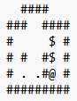

  

# Sokoban Solver

## Introduction
The Sokoban Solver is a Python-based application designed to solve Sokoban puzzles, a classic warehouse organization challenge. The solver leverages advanced search algorithms, state space exploration, and domain-specific optimizations to find efficient solutions.

## Technologies Used

  

## Features
Flexible Search Options: Supports solving puzzles using elemental moves (agent movements and box pushes) or macro actions (box pushes only).
Taboo Cell Identification: Identifies "taboo" cells where boxes should not be placed, optimizing the solution space.
Pathfinding Utility: Includes a can_go_there function to verify if the agent can reach a specific cell without pushing boxes.
Customizable Warehouses: Easily define puzzle configurations through plain text warehouse files.

## Project Structure
The project comprises three primary components:

### 1. search.py
Defines the search algorithms used to solve Sokoban puzzles, including breadth-first search, depth-first search, and other heuristic methods. This file serves as the backbone for exploring and navigating the state space of the puzzle.

### 2. sokoban.py
Implements the Sokoban problem class and related functions:

### 3. solver.py
Implement the solver and related functions
Handles state transitions based on elemental or macro actions.
Contains the find_taboo_cells function to identify invalid box positions.

### Warehouse Files
Warehouse configurations are stored in plain text files, with each file representing a Sokoban puzzle. A typical file contains walls, boxes, goals, and the agent's initial position.

Example Warehouse File:

  

Elemental Actions: Solves puzzles using both agent movements and box pushes.
Macro Actions: Focuses solely on box pushes for efficient solution finding.
find_taboo_cells: Optimizes puzzle-solving by identifying cells unsuitable for boxes.
can_go_there: Determines if the agent can navigate to a specific cell.
